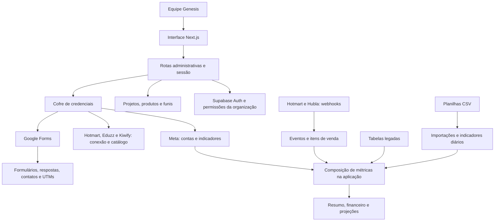

# Diagnóstico e plano de conclusão da Central Genesis

Análise realizada em 6 de setembro de 2026 sobre o código local, incluindo as alterações que já existiam na pasta.

## Objetivo identificado

A Central pretende apoiar a operação de projetos digitais de experts: cadastrar o projeto, associar produtos às etapas do funil, reunir anúncios e vendas, acompanhar contatos e comparar resultados com metas e projeções.

O resultado esperado parece ser responder, por projeto e período: quanto foi investido, quanto foi vendido, qual produto converteu, qual resultado sobrou e qual pendência impede a operação. Essa interpretação vem do README, do modelo de dados e das telas; ainda precisa ser confrontada com um exemplo real de uso da equipe.

Existe uma base funcional aproveitável. O banco possui organização, permissões, cofre de credenciais, transações, histórico de mapeamento e testes de isolamento. O principal trabalho restante é consolidar regras de negócio, completar a entrada de dados e transformar as telas em um fluxo de operação coerente.

## O que foi efetivamente verificado

| Verificação | Resultado |
|---|---|
| Instalação usando o arquivo de dependências fixadas | Concluída |
| Análise estática do código | Aprovada |
| Verificação TypeScript | Aprovada |
| Testes da aplicação antes das correções | 53 aprovados |
| Testes da aplicação após as correções | 80 aprovados, em 13 arquivos |
| Compilação de produção após as correções | Aprovada |
| Verificação da função Meta com Deno | Aprovada usando o lockfile existente |
| Verificação estrutural do banco local | Nenhum erro encontrado |
| Testes do banco local | 125 aprovados; executados em transação com rollback |
| Navegação no navegador | Visão geral e projeto, incluindo a tela de métricas, em demonstração |

O banco local já tinha as 14 migrations do repositório. Não foi recriado nem apagado. Os testes locais não comprovam a instalação das mesmas migrations em produção.

O conector do Supabase recusou acesso ao projeto configurado. Não foi possível confirmar estado de produção, credenciais dos provedores, agendamentos, logs ou entregas reais de webhooks. Os testes de integração adicionados usam respostas simuladas. Login e saída de uma conta real não foram exercitados. Nenhuma publicação ou alteração no banco remoto foi realizada.

## Estrutura atual



O expert representa uma pessoa ou operação. O projeto pertence à organização e a um expert. Produtos pertencem a uma conexão ou são manuais; mapeamentos os ligam a etapas do projeto, com histórico de vigência. Anúncios e vendas chegam por caminhos diferentes e são combinados na leitura.

Hoje há duas gerações do modelo convivendo: tabelas normalizadas e tabelas legadas identificadas por slug. A importação CSV acrescenta uma terceira origem de indicadores. A combinação dessas origens se repete no carregamento do resumo e no detalhamento.

## Maturidade dos módulos

| Módulo | O que existe | O que falta para concluir |
|---|---|---|
| Acesso | Login, cadastro, bootstrap e autorização por organização | Administração de membros pela interface, recuperação de senha e revisão do fluxo de confirmação de e-mail |
| Projetos | Assistente, status, metas, exclusão lógica, catálogo e funil editáveis | Rascunho sem integração obrigatória; esclarecer projeto contínuo versus lançamento/campanha |
| Meta Ads | Cadastro de credenciais, descoberta de contas, sincronização manual e função para agendamento | Comprovar o agendamento remoto, expor falhas e atualização real, reduzir duplicação entre os dois sincronizadores |
| Hotmart | Credencial, catálogo, webhook de compra e reembolso, tratamento idempotente | Validar uma compra, repetição e reembolso reais no ambiente de homologação |
| Hubla | Endpoint, confirmação por evento, descoberta a partir dos eventos, compra e reembolso | Validar eventos reais, experiência de configuração e resolução de pendências |
| Eduzz e Kiwify | Validação da conexão e importação de catálogo | Não há receptores de vendas dessas plataformas no código revisado |
| CSV | Validação, prévia, preservação do original, histórico e prevenção de duplicação | Definir valores financeiros históricos e regra explícita para coexistência com webhooks e Meta |
| Métricas | Indicadores diários, financeiro, custos, metas e projeções | Unificar período, significado de produto principal e origem de cada número |
| Forms, contatos e UTMs | OAuth, schema, respostas, deduplicação e atribuição | Mapeamento explícito de campos, resolução de conflitos e navegação completa pelos contatos |
| Simulador | Cálculo em cascata e a partir da base | Salvar cenários e associá-los a um projeto, se fizer parte da operação desejada |
| Configurações | Presença de variáveis e existência de tabelas | Separar presença de configuração, validade da credencial e recebimento recente de dados |

## Correções realizadas nesta análise

### Credencial administrativa no arquivo de exemplo

O arquivo `.env.example` da cópia de trabalho continha uma credencial administrativa real do Supabase. Os valores reais foram removidos e o exemplo passou a ter campos vazios. Uma busca por padrões de credenciais nos arquivos rastreados atuais não encontrou outros resultados; isso não equivale a uma auditoria completa de todos os commits e segredos possíveis.

**Correção em 8 de setembro:** a checagem inicial do Git classificou um valor de exemplo iniciado por `sb_secret_` como segredo real. A versão HEAD possui um valor de exemplo; não foi comprovado que a chave real da cópia de trabalho foi registrada no histórico. A afirmação anterior sobre exposição confirmada no Git era imprecisa.

**Pendente:** substituir a credencial administrativa identificada e atualizar os ambientes que a utilizam. A remoção do arquivo não revoga a chave. Ela corresponde ao papel `service_role` do projeto Supabase `hrcxlljvoemiaqhkihqp` e à variável `SUPABASE_SECRET_KEY`. O `.env.local` foi preservado. Não houve rotação de credenciais nem reescrita do histórico nesta análise.

### Sincronização automática da Meta podia apagar indicadores

Se a leitura da credencial de uma conta falhava, a função continuava a coleta e depois substituía o período de todas as contas, incluindo a conta não consultada. Como a substituição remove dados anteriores, uma falha de leitura podia resultar em perda de indicadores.

A função agora interrompe o projeto antes da substituição quando falta uma credencial. Também rejeita resposta sem lista de dados, limita paginação, impede o envio do token para outro domínio e trata expiração das consultas. O sincronizador manual também passou a rejeitar resposta sem lista válida.

Testes cobrem duas contas, falha na segunda credencial, token vazio, erro do cofre, paginação inválida ou circular e falha de rede. A proteção é por projeto; projetos anteriores já concluídos numa execução não são revertidos se um projeto posterior falhar. A mudança precisa ser publicada para proteger a função remota.

### Sessão expirada retornava uma página HTML para chamadas da API

O mecanismo de sessão redirecionava operações para o login. O navegador podia seguir o redirecionamento e entregar HTML a uma tela esperando JSON, ocultando a causa da falha.

As APIs agora recebem JSON com status 401; a ausência de configuração retorna 503. Páginas continuam sendo redirecionadas ao login. Cookies de sessão removidos são preservados na resposta. Webhooks e páginas públicas deixaram de depender de uma consulta ao serviço de autenticação.

### Demonstração ignorava a opção de desativação em desenvolvimento

Antes, a ausência de configuração ativava demonstração automaticamente em desenvolvimento, mesmo com `NEXT_PUBLIC_DEMO_MODE=false`. Agora é necessário definir explicitamente `true`.

### Simulador mantinha vendas com conversão zero

Ao zerar a conversão, o cálculo reaproveitava a quantidade preexistente da etapa. Agora uma etapa posterior com conversão zero gera zero vendas; na cascata, isso se propaga. O botão Restaurar também recupera meta e modo de conversão.

### Saída da conta

Foi incluída a ação Sair da conta na barra lateral. Ela encerra a sessão local e navega novamente para o login, descartando os dados em memória da navegação. Falhas na saída são apresentadas ao usuário.

## Pendências com maior impacto

### 1. Receita histórica de CSV depende do preço atual — prioridade alta

**Evidência:** `src/lib/data.ts`, funções `normalizedCsvRevenue` e `applyNormalizedCsv`; a tabela de importação armazena quantidades, e o faturamento é calculado com `config.ticketNetPrice` e os preços atuais dos order bumps.

**Exemplo:** uma linha com 100 ingressos passa de R$ 2.000 para R$ 3.000 quando o preço configurado muda de R$ 20 para R$ 30. O arquivo original continua preservado, mas o valor financeiro exibido muda retroativamente.

**Decisão necessária:** essa receita é uma estimativa recalculável ou um registro financeiro fechado? Para registro financeiro, preservar valores por linha/transação ou preços com vigência e uma política explícita de correção do histórico.

### 2. Importações substituem as outras fontes do mesmo dia — prioridade alta

**Evidência:** `getProjects` e `getProjectAnalytics` em `src/lib/data.ts` reaplicam o CSV normalizado depois do legado e da view de métricas. Eventos de produto são ignorados nas datas presentes no CSV normalizado.

**Consequência:** um evento ou reembolso que chega depois pode não aparecer no consolidado de um dia coberto pelo CSV. Isso evita soma duplicada, mas exige uma política clara de reconciliação.

**Proposta:** escolher a fonte por tipo de dado e intervalo, exibir a origem no relatório e registrar substituições. Decidir se CSV é histórico fechado, substituição manual ou fonte temporária até a integração funcionar.

### 3. Produto principal tem definições diferentes — prioridade alta

**Evidência:** o funil aceita `core`, `low_ticket` e `front_end`; as premissas reconhecem esses tipos como possíveis ingressos. Entretanto, a view `project_daily_metrics` e `calculateDailyPerformance` contam como core apenas o tipo `core`.

**Consequência:** um ingresso configurado como Low Ticket pode gerar receita e ainda não entrar na quantidade usada pelo CPA/core. O tipo escolhido no cadastro passa a mudar o significado do indicador.

**Proposta:** definir o papel comercial do produto principal uma única vez e reutilizá-lo no banco, nos cálculos, na importação e na interface. Evitar contar dois produtos como aquisição do mesmo comprador sem uma regra explícita.

### 4. Resumo, tabela diária e financeiro usam escopos diferentes — prioridade alta

**Evidência:** a visão geral usa o mês atual e `calculatePerformance` sem custos adicionais. O financeiro usa o período salvo, taxa de tráfego e custos operacionais. O filtro De/Até da tabela diária não altera `financial`, que é calculado com `populatedRows`.

**Exemplo:** R$ 1.000 de receita e R$ 500 de mídia geram R$ 500 após mídia. Com taxa de 13,85% e R$ 100 de custos, o resultado operacional é R$ 330,75. Ambos podem ser úteis, desde que o nome e o período deixem clara a diferença.

**Proposta:** período visível e compartilhado, distinção entre saldo após mídia e lucro operacional e critérios documentados para ROAS, CPA, receita líquida, reembolso e participação da Genesis.

### 5. Consolidado pode truncar dados com o crescimento — prioridade alta

**Evidência:** `getProjects` consulta métricas e catálogos de vários projetos sem paginação. O ambiente local define `max_rows = 1000`. A leitura de eventos detalhados já pagina, mas o consolidado não.

**Consequência:** 34 projetos com 31 dias podem exceder mil linhas de métricas. A API pode devolver uma resposta bem-sucedida incompleta e o consolidado somar apenas parte da carteira. O limite efetivo de produção não foi verificado.

**Proposta:** agregar no banco com limites por organização/período ou paginar integralmente com ordenação estável; criar um teste que exceda o limite de uma página. O cadastro/listagem de contatos também precisa de paginação: atualmente são carregados até 100 contatos.

### 6. Conexão aprovada não significa integração operacional — prioridade alta

Eduzz e Kiwify podem validar acesso e importar produtos, mas não existe ingestão de vendas dessas plataformas no repositório. Na tela de configurações, uma variável preenchida pode aparecer pronta sem a credencial ter sido testada. Google Forms é tratado como parte da fundação, embora possa ser opcional para um projeto.

**Proposta:** estados separados para configurada, credencial validada, ativos vinculados, primeiro dado recebido e atualização recente. Completar primeiro a plataforma realmente usada pela operação; apresentar capacidades ainda ausentes com precisão.

### 7. Cadastro de projeto depende de integração pronta — prioridade média

**Evidência:** `projectInputSchema` exige `salesConnectionId`; o assistente e `create_project_with_funnel` também validam essa conexão. Não é possível preparar um projeto real somente com nome, expert e funil.

**Proposta:** permitir rascunho e completar integrações depois, caso esse seja o fluxo desejado. Distinguir cadastro concluído de projeto pronto para receber dados. A ligação com expert também precisa representar reutilização do mesmo expert entre lançamentos.

### 8. Gestão de acessos e recuperação ainda incompletas — prioridade média

Há papéis no banco, mas a barra lateral apresenta Administrador de forma fixa e não há gestão de membros ou recuperação de senha na aplicação. O primeiro acesso depende de uma lista de e-mails; em produção, é necessário confirmar que o cadastro exige comprovação de propriedade do e-mail antes do bootstrap. Essa configuração remota não foi verificada.

**Proposta:** definir papéis da equipe, administrar convites e membros, refletir as permissões nas ações da tela e testar cadastro, confirmação, login, expiração, recuperação e saída em homologação.

### 9. Acompanhamento de falhas precisa ficar operacional — prioridade média

O código tem `sync_runs`, mas não há uma central de execuções e pendências. A função automática da Meta tem um segredo de agendamento, sem configuração de agendamento encontrada nas migrations. Isso não comprova ausência de um agendamento remoto. A data exibida no resumo é o último dia com dados, não necessariamente o horário da última consulta bem-sucedida.

**Proposta:** mostrar última tentativa, último sucesso, período coberto, erro legível e ação para tentar novamente; comprovar o agendamento; definir o comportamento com dados parciais e projetos pausados. Acrescentar telas de recuperação para falhas de carregamento.

### 10. Forms e UTMs dependem de inferências pouco controláveis — prioridade média

**Evidência:** `inferIdentityAndUtm` identifica campos pelo texto das perguntas; a vinculação inicia `p_field_mapping` vazio. A paginação de respostas para depois de 20 páginas sem indicar explicitamente que ainda restaram páginas.

**Proposta:** permitir confirmar o mapeamento das perguntas, expor respostas sem associação/conflitos e persistir progresso de sincronização. Antes de avançar o cursor, comprovar leitura completa para evitar omissões em grandes formulários.

### 11. Demonstração e prontidão podem transmitir uma impressão incorreta — prioridade média

Os exemplos têm datas fixas de julho de 2026. Na conferência em setembro, o resumo tinha valores enquanto a tabela diária filtrada pelo mês atual estava vazia; a prontidão ainda mostrava 5/5.

**Proposta:** gerar exemplos no período exibido e separar prontidão de configuração de qualidade/atualização dos dados. Em dados reais, zero vendas pode ser um resultado válido; não deve ser automaticamente confundido com integração quebrada.

## Estrutura proposta para concluir o produto

### Navegação da equipe

| Área | Responsabilidade |
|---|---|
| Visão geral | Comparar projetos ativos no mesmo período, com critérios financeiros explícitos |
| Projetos | Cadastro, status, responsável, pendências e acesso ao projeto |
| Projeto · Resultados | Visão resumida, tabela diária e financeiro com período compartilhado |
| Projeto · Funil e produtos | Papéis dos produtos, etapas, mapeamentos e histórico |
| Projeto · Público | Formulários, contatos e atribuição UTM agrupados |
| Projeto · Operação | Fontes, importações, sincronizações, eventos pendentes e erros |
| Projeto · Planejamento | Metas, custos previstos, premissas e cenários salvos |
| Administração | Integrações compartilhadas, membros e configuração do ambiente |

A prontidão deve ocupar um resumo compacto e abrir detalhes quando houver pendências. Na tela examinada, ela ocupa uma grande área acima de todas as abas. A tabela diária precisa de uma visão inicial menor, com detalhamento por produto disponível sob demanda; o modelo dinâmico do funil hoje convive com uma apresentação fixa de três order bumps.

Essa organização é uma proposta para discussão, não uma mudança de navegação já implementada.

### Organização do código

Extrair responsabilidades gradualmente, enquanto cada fluxo é corrigido e verificado:

```text
src/features/
  projects/       cadastro, status e configuração do projeto
  catalog/        produtos, etapas e mapeamentos
  integrations/   credenciais, capacidades e estado das conexões
  reporting/      período, origem dos dados e indicadores compartilhados
  imports/        inspeção, validação e histórico de arquivos
  audience/       formulários, contatos e atribuição
  planning/       metas e cenários
src/lib/supabase/ clientes e tipos gerados do banco
src/app/          rotas e composição das páginas
supabase/         regras persistentes, migrations, funções e testes
```

`project-workspace.tsx` e `project-metrics-panel.tsx` concentram mais de mil linhas cada; `data.ts` mistura carregamento, compatibilidade, transformação e regras de métricas. A prioridade da extração deve ser uma única composição de indicadores com testes de origem/período, seguida de componentes por área. Gerar tipos do banco para reduzir consultas e respostas tratadas com conversões manuais.

## Ordem sugerida de execução

| Etapa | Entrega | Critério verificável de conclusão |
|---|---|---|
| 1. Proteger a base | Rotação da chave exposta; publicar as correções revisadas; confirmar estado de homologação/produção | Chave antiga deixa de funcionar; sincronização com falha não altera histórico; sessão expirada retorna erro claro |
| 2. Fechar um projeto de referência | Escolher um projeto real e sua plataforma principal | Cadastro, produto, compra, evento repetido, reembolso e mídia reconciliados com a fonte |
| 3. Consolidar indicadores | Fonte por período, valores históricos, papéis de produto e custos | Resumo, detalhes e exportação reconciliam para o mesmo período e conceito; histórico não muda inadvertidamente |
| 4. Completar a operação | Rascunho, configuração guiada, acessos, pendências e execuções | Uma pessoa da equipe conclui o fluxo sem editar o banco ou depender de instruções técnicas externas |
| 5. Reorganizar as telas e módulos | Navegação proposta, componentes menores e relatórios testáveis | Usuário encontra resultado, fonte e ação de correção sem atravessar múltiplas abas de configuração |
| 6. Expandir e validar escala | Demais provedores, cenários, grandes carteiras e grandes formulários | Testes além dos limites de paginação, reprocessamento seguro e novos provedores com venda real comprovada |

## Definições de negócio ainda necessárias

- Um projeto representa a operação contínua de um expert, uma campanha ou uma edição de lançamento?
- Qual plataforma de vendas deve funcionar primeiro e qual projeto serve como referência?
- CSV deve substituir os dados integrados ou apenas preencher períodos sem integração?
- O principal resultado é saldo após mídia, lucro total da operação ou participação líquida da Genesis?
- Quais pessoas precisam editar configurações, operar projetos e apenas consultar relatórios?
- Quais números da fonte externa e qual período serão usados para aceitar que o primeiro projeto está correto?

Com essas definições, a próxima entrega pode ser medida por um fluxo completo com dados conciliados, em vez de pela quantidade de telas disponíveis.
